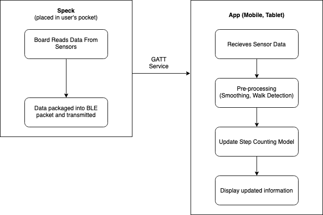
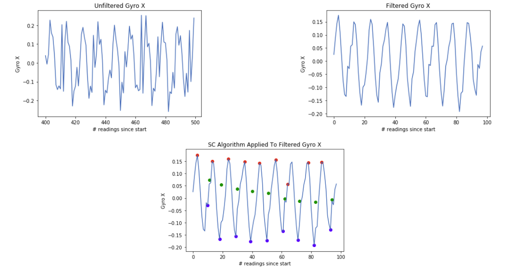

# stepz

Stepz is a step counting system which uses a pocket mounted IoT sensor to detect a users movement. It was developed as part of Edinburgh University's "Principles and Design of IoT systems" over several months. The system is able to accurately count steps achieving over 85% accuracy when walking, climbing and descending stairs and running (±2 step threshold). This greatly out performed popular step counting apps available on the Play Store.

## Architecture

The system is comprised of two parts -- a wireless speck with an onboard accelerometer and gyroscope and an Android app. The Speck was responsible for collecting data about the users movement and transmitting it over BLE to the user's app. The app received the data, processed it and updated the step count information as well as estimating calories burned and distance travelled.

## Algorithm

The algorithm used was adapted from [Step Detection Robust Against the Dynamics Of Smartphones](https://pubmed.ncbi.nlm.nih.gov/26516857/) and used the gyroscope data to perform a windowed peak detection algorithm which cadence adapted to the users cadence. To improve accuracy, we filtered our data using a simple moving average.

This algorithm allowed for good performance in real-world situations where the user's cadence is not steady; for example walking on busy street. 

### Walk Detection
Our step counter was triggered by a simple thresholding system which detected a rapid change in acceleration inspired by [Walk Detection and Step Counting on Unconstrained Smart Phones](https://www.researchgate.net/publication/262321404_Walk_detection_and_step_counting_on_unconstrained_smartphones). To reduce the number of false positives, the system will discard any step sequences with less than 3 steps. 

## Results

Our system was able to outperform a the Editor's choice step counter on the Google Play Store and was more robust against novel activities such as stair climbing and playing football.

| Activity               | Stepz Accuracy % (±2) | Pedometer App % (±2) |
|------------------------|-----------------------|----------------------|
| Walking (10 Steps)     | 96.7                  | 69.2                 |
| Walking (100 Steps)    | 85.3                  | 60.0                 |
| Running (50 Steps)     | 90.0                  | 50.0                 |
| Stairs Up (14 steps)   | 100.0                 | 64.0                 |
| Stairs Down (14 steps) | 96.0                  | 52.0                 |

| Activity                     | Stepz RSME | Pedometer RSME |
|------------------------------|------------|----------------|
| Football (steps)             | 1.41       | 3.2            |
| Distance Estimation (metres) | 1.73       | N/A            |